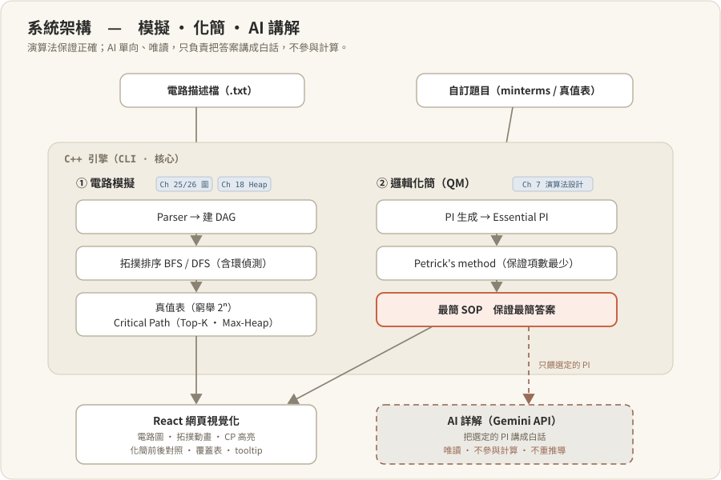
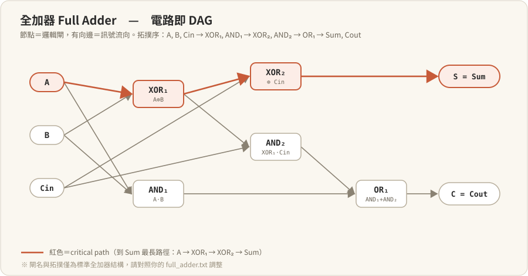
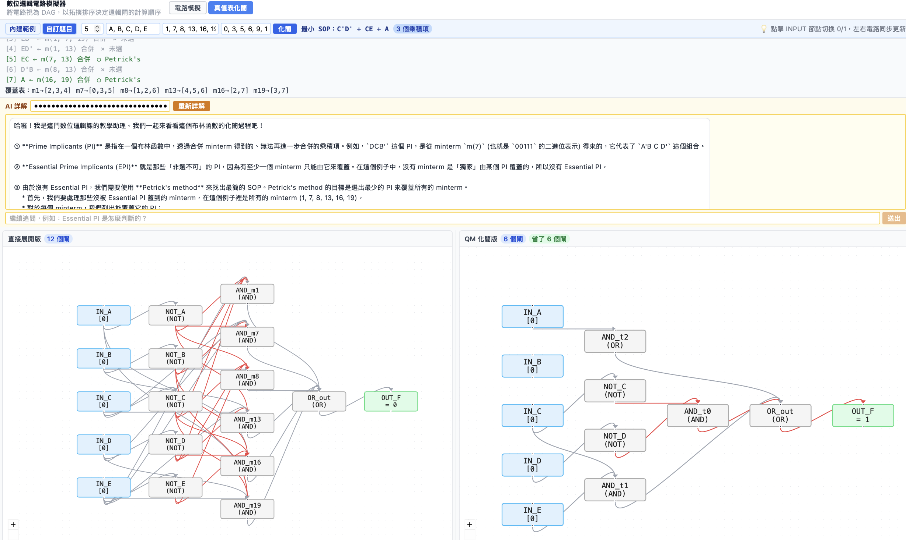
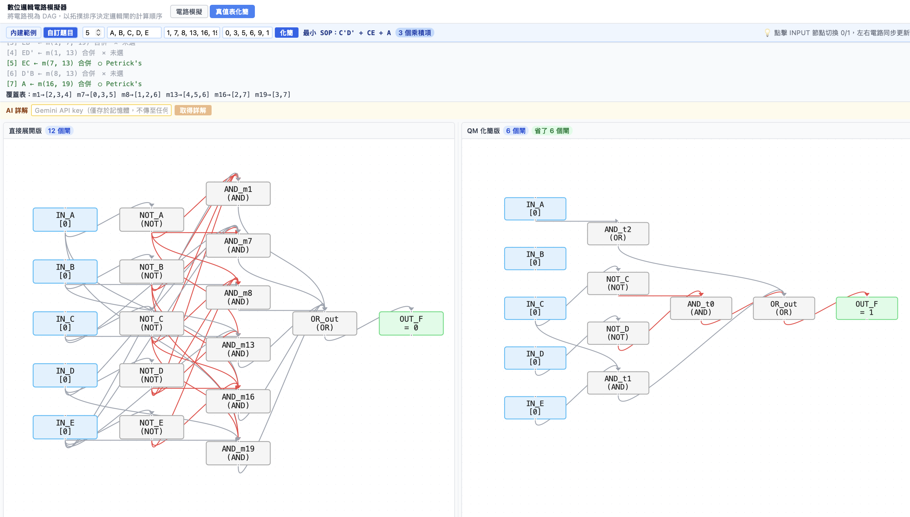
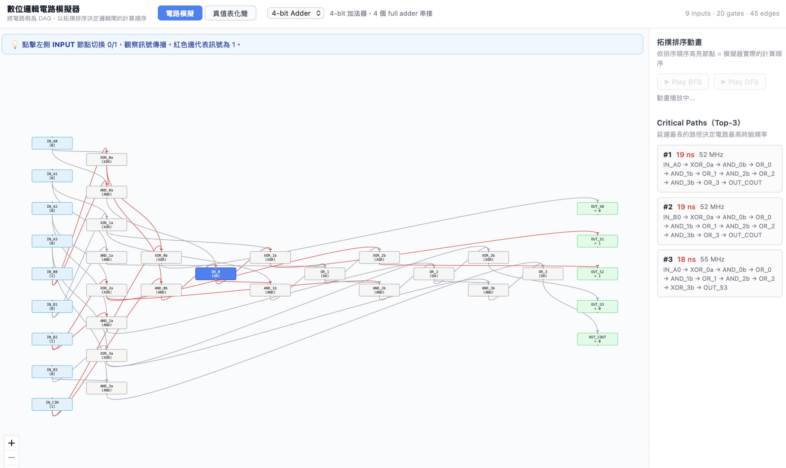

# 數位邏輯電路模擬器

<p align="center">
  
</p>

## Proposal Report

### 動機與目標

電腦的一切運算都建立在最基礎的邏輯閘上：AND、OR、NOT。從這些簡單的元件出發，可以組合出加法器、多工器，甚至整個 CPU。修資料結構的過程中，我開始好奇：「這些抽象的資料結構，能不能直接對應到硬體的運作方式？」

本專題以此為起點，開發一個 C++ 命令列工具：使用者用文字描述一個數位邏輯電路（指定邏輯閘與連線方式），程式自動分析電路結構、計算輸出結果，並產生完整的真值表。目的是把課程學到的資料結構，實際用在模擬硬體的運作上。

本專題也規劃在後續階段把工具擴展為邏輯化簡解題器，並用 AI（Gemini API）提供白話詳解。這裡有一個刻意的分工：邏輯化簡有標準答案，但 AI 即使算出正確、甚至最簡的式子，也沒有內部機制能證明它就是最簡，這種保證只有精確演算法給得出來。所以保證最簡的工作交給演算法（QM + Petrick's），AI 只負責把標準答案講成初學者讀得懂的解題過程，完全不參與計算。

### 競品比較

| 項目 | Logisim | CircuitVerse | 本專題 |
|------|---------|--------------|--------|
| 類型 | Java 桌面應用程式 | 線上網頁模擬器 | C++ 工具 + React 網頁前端 |
| 使用方式 | 圖形拖拉介面 | 圖形拖拉介面 | 文字描述檔 + 網頁互動 |
| 保證最簡化簡 | 部分（K-map 工具，小規模） | 部分（Boolean expression 工具） | ✅ QM + Petrick's method，保證項數最少 |
| 拓撲排序可視化 | ❌ 黑箱處理 | ❌ 黑箱處理 | ✅ 顯示計算順序與 DAG 結構 |
| 關鍵路徑分析 | ❌ | ❌ | ✅ 計算最長延遲路徑 |
| 演算法教學用途 | 低（重視操作） | 低（重視操作） | 高（展示資料結構如何驅動模擬） |
| 學習門檻 | 中（需安裝 Java） | 低 | 低（g++ 編譯 + 開瀏覽器） |

**本專題的定位差異：** Logisim 和 CircuitVerse 是給使用者操作電路的工具，重點在圖形介面。本專題的重點則在電路模擬背後的演算法：使用者可以看到 DAG 怎麼建構、拓撲排序怎麼決定計算順序、Heap 怎麼找出關鍵路徑。前兩者是用工具學電路，本專題比較像是藉著做電路來練資料結構。

### 預期功能

1. **基礎邏輯閘模擬**：支援 AND、OR、NOT、XOR、NAND、NOR 六種基本邏輯閘，每個閘以物件（class）實作，可接受任意數量的輸入。
2. **電路描述檔解析**：使用者撰寫簡單的文字檔描述電路結構（元件名稱、類型、連線關係），程式解析後建構出對應的電路圖。
3. **自動訊號傳播**：將電路視為有向無環圖（DAG），以拓撲排序決定各邏輯閘的計算順序，確保輸入訊號在輸出之前已正確計算。
4. **真值表產生**：窮舉所有輸入組合，自動計算並印出完整的真值表。
5. **組合電路範例**：內建半加器（Half Adder）、全加器（Full Adder）、4-bit 加法器、多工器（MUX）等經典電路範例。

#### 進階功能（視時間而定）

6. **時序電路支援**：加入 D 正反器（D Flip-Flop）與時脈訊號，支援計數器等時序邏輯電路的模擬。
7. **關鍵路徑分析**：為每個邏輯閘設定傳播延遲，計算電路從輸入到輸出的最長延遲路徑（Critical Path）。
8. **互動式視覺化介面**：以網頁呈現電路圖，支援即時切換輸入、動態顯示訊號傳播、拓撲排序步進展示。

### 使用技術

| 技術 | 說明 |
|------|------|
| **DAG（有向無環圖）** | 將電路視為圖：邏輯閘為節點，連線為邊。整個電路形成一個 DAG，確保訊號從輸入端單向傳播到輸出端。 |
| **拓撲排序（Topological Sort）** | 核心演算法。對 DAG 進行拓撲排序，決定邏輯閘的計算順序，保證每個閘在計算時其所有輸入已經就緒。 |
| **雜湊表（Hash Map）** | 使用 `std::unordered_map` 儲存元件名稱與物件的對應關係，達成 O(1) 的元件查詢。 |
| **二元搜尋樹（BST）** | 以 `std::map`（底層為紅黑樹）管理電路中的訊號線名稱，維持有序的訊號列表以便輸出真值表。 |
| **堆積與優先權佇列（Heap / Priority Queue）** | 用於進階功能「關鍵路徑分析」，以最大堆積追蹤最長延遲路徑。 |
| **樹（Tree）** | 在單一輸出、無分支共用的子電路上，訊號計算等同於對樹進行後序遍歷（post-order traversal）；一般含 fan-out 的電路則為 DAG，改由拓撲排序處理。 |
| **Struct / Class（OOP）** | 使用繼承與多型設計邏輯閘的類別階層：基底類別 `Gate`，衍生出 `AndGate`、`OrGate`、`NotGate` 等子類別。 |

### Prototype 預計可驗證內容

Prototype 階段預計完成以下可驗證的功能：

1. **電路描述檔解析器（Parser）能正確讀取 .txt 檔案並建構 DAG**
   - 驗證方式：載入內建的半加器、全加器、MUX 描述檔，印出解析結果，確認元件與連線正確。

2. **拓撲排序能正確決定邏輯閘的計算順序**
   - 驗證方式：印出拓撲排序結果，人工檢查順序是否滿足「每個閘在計算前，其所有輸入皆已就緒」的條件。

3. **真值表輸出結果正確**
   - 驗證方式：以半加器為例，預期真值表為 `{(0,0)→(0,0), (0,1)→(1,0), (1,0)→(1,0), (1,1)→(0,1)}`（輸出格式為 `(Sum, Carry)`），與程式輸出比對。再以全加器驗證 8 種輸入組合的 Sum 與 Carry 是否正確。

4. **能偵測電路中的迴圈（非 DAG）並報錯**
   - 驗證方式：故意建立一個有迴圈的電路描述檔，確認程式能偵測並印出錯誤訊息。

---

## Prototype Report

### 目前進度

目前已完成 Proposal 中列出的全部 4 項可驗證功能；對應的實作功能共 5 項，如下：

**✅ 已完成的功能：**

1. **六種邏輯閘模擬（AND、OR、NOT、XOR、NAND、NOR）**
   以物件導向設計實作：Gate 基底類別 + 各子類別，使用虛擬函式（polymorphism）實現不同閘的 `compute()` 邏輯。

2. **電路描述檔解析器（Parser）**
   支援自定義的 `.txt` 格式，可定義 INPUT、OUTPUT、GATE 及連線關係（`->`）。已通過半加器、全加器、MUX 三個測試檔的驗證。

3. **DAG 建構 + 拓撲排序**
   將電路建構為有向無環圖，並以拓撲排序決定邏輯閘的計算順序，確保每個閘在計算時其所有輸入皆已就緒。實作採用 Kahn's Algorithm（BFS，Queue + 入度表），並能正確偵測電路中的迴圈。

4. **真值表自動產生**
   窮舉所有 2^n 種輸入組合，逐一模擬並印出完整真值表。已驗證半加器（4 組）、全加器（8 組）、4-bit 加法器（512 組）的輸出結果皆正確。

5. **4 個內建範例電路**
   半加器（2 閘）、全加器（5 閘）、2-to-1 MUX（4 閘）、4-bit 加法器（20 閘）。

### 遇到的困難

1. **迴圈偵測的設計**：拓撲排序需要在計算前確認電路無迴圈，一開始只用 visited 布林值，結果導致誤判。後來改用三態標記（未訪問 / 訪問中 / 已完成）才能正確分辨 back edge，解決誤判問題。

2. **進位鏈的依賴順序**：4-bit 加法器由 4 個全加器串接，carry 必須逐級傳播，形成較長的依賴鏈。做這題時才真正理解為什麼一定要先做拓撲排序：若計算順序錯了，後級的閘會讀到還沒更新的輸入，結果就錯。排好順序後，512 組輸入皆驗證正確。

### 中期方向調整

原本只打算做電路模擬器。實作 QM 邏輯化簡（原本只是輔助功能）時發現，既然引擎已經能對任意 minterms 化簡，乾脆擴展成可以解任意化簡題的工具，再配合 AI 提供白話詳解，讓沒學過邏輯設計的人也能看懂解題過程。這比單純展示電路更實用，所以下一步計畫加入解題器與 AI 整合。

### 下一步計畫

1. **關鍵路徑分析（Critical Path）**：為每個邏輯閘加入傳播延遲值，使用 DAG 最長路徑演算法 + Priority Queue 找出電路的關鍵路徑，計算最大時脈頻率。
2. **互動式視覺化介面**：以 React 實作網頁版電路視覺化，支援即時切換輸入、動態訊號傳播動畫、拓撲排序步進展示。
3. **邏輯化簡解題器**：擴展 QM 模組為可接受任意題目輸入（自訂 minterms / 真值表），覆蓋選取從貪心進階到 Petrick's method，保證項數最少；同步整合 AI（Gemini API），依演算法算出的中間結果產生白話詳解，使用者輸入一題即可得到答案與詳解。
4. **錄製 Demo 影片**：展示電路模擬功能、Critical Path 分析、視覺化介面與解題器流程。
5. **對解題器做更大規模測試**：以更多變數、更複雜的題目驗證 QM + Petrick's 的正確性與效率。

---

## Final Report

### 專案說明

背景：邏輯化簡在做什麼？

數位電路的功能可以寫成一條布林式（例如 F = A'BC + AB'C + ...）。同一個功能往往有很多種寫法，但項數越少、變數越少，實際做成電路時用的邏輯閘就越少、跑得越快。邏輯化簡就是找出那條「最精簡」的等價式子。

人工常用卡諾圖（Karnaugh map），但變數一多就畫不動；Quine-McCluskey（QM） 是它的系統化、可程式化版本，而 Petrick's method 進一步保證得到的結果項數真的最少（而非只是「夠好」）。本專題實作的就是 QM + Petrick's。

本專題從電路模擬器出發，最終擴展為一個整合「**電路模擬 + 邏輯化簡解題器**」的數位邏輯工具，搭配 React 視覺化前端。前者把電路視為 DAG、以拓撲排序決定邏輯閘的計算順序，讓使用者直接看到電路如何運作；後者讓使用者輸入任意題目，即可得到保證最簡的答案，並由 AI 產生白話詳解。

<p align="center">
  
  <br><em>全加器以 DAG 表示，紅色為到 Sum 的最長路徑（critical path）</em>
</p>

整個工具因此涵蓋模擬 → 分析 → 化簡 → 解題的流程，從學習用的模擬器延伸成一個能實際解題的小型工具鏈。

### 核心觀察

#### 1. 演算法負責保證正確，AI 負責表達

邏輯化簡有標準答案，但 LLM 即使給出正確、甚至最簡的式子，也沒有任何內部機制能證明它就是最簡，它可能回答「已經最簡」，但其實還有更簡的解。要保證最簡，只能靠精確演算法。

所以分工很清楚：**QM + Petrick's 算出保證項數最少的答案，AI 只把這組答案講成白話詳解，完全不參與計算**。AI 詳解的 prompt 嚴格鎖定在演算法實際選出的那組 prime implicants 上，不准重新推導、也不准提出其他解答，確保 AI 不會影響答案的正確性。

關於 Petrick's 的取捨：Prototype 階段先用貪心覆蓋，在所有測試題目上都得到正確結果。但貪心是 Set Cover 的啟發式，理論上不保證項數最少，只是小規模題目很少觸發反例。為了讓「保證最簡」這個宣稱成立，Final 階段加入 Petrick's method：把剩餘未覆蓋的 minterms 用布林乘積完整展開，求出項數最少的覆蓋。貪心版保留為對照函式 `minimizeGreedy()`，可以對照啟發式解與精確最小解的差別。

<p align="center">
  
  <br><em>AI 依演算法選定的 PI 產生四步白話詳解 </em>
</p>

#### 2. Critical Path：把資料結構連到實際的時脈頻率

Top-K 最長路徑搜尋是本專題用到最多資料結構的地方：拓撲排序確定計算順序，DP 求每個節點的最長到達延遲，再用 Max-Heap 反向取出延遲最大的 K 條完整路徑。輸出可以直接換算成電路的最高工作頻率（全加器 critical path 3 ns → 333 MHz）。現代 CPU 的時脈設計其實也是同一個 DAG 最長路徑問題（工業界的 Static Timing Analysis 還會再處理 false path、setup/hold time、clock skew 等）。

### 考題驗證

以臺大電機 2021–2025 學年期中考的真值表化簡題共 5 題作為驗證集，把每題的 minterms 輸入解題器，化簡結果與標準答案全數一致。這 5 題涵蓋 3~4 個變數、含 don't care、不同的 minterm 結構，可以驗證 QM + Petrick's 在課程範圍內的正確性。

### 最終實作的功能

#### 主功能：邏輯化簡解題器 + AI 詳解

| 功能 | 說明 |
|------|------|
| **任意題目輸入** | 網頁提供「自訂題目」面板，直接輸入變數數、minterms、don't cares；CLI 提供 `--qm-inline` 旗標，可在指令列直接帶入 |
| **QM 化簡（Petrick's method）** | 演算法：PI 生成 → Essential PI 選取 → **Petrick's method**（布林乘積完整展開，保證項數最少）→ 穩定的挑選規則（項數最少 → literal 最少 → minterm 字典序）；保留 `minimizeGreedy()` 為貪心對照 |
| **Prime implicant 中間步驟顯示** | 列出全部 PI、標示哪些是 essential（★）、哪些由 Petrick's 選中（○），以及 minterm-to-PI 覆蓋表 |
| **AI 詳解（Gemini API）** | 使用者貼上自己的 Gemini API key（`localStorage` 永久儲存，只存在使用者瀏覽器），網頁直接呼叫 Gemini；prompt 嚴格綁定演算法實際選的那組答案，AI 只負責用四步骨架（全部 PI → essential 是哪些 → Petrick's 怎麼選 → 省了多少）講成白話 |
| **化簡前後電路對照** | 同畫面並排顯示「直接展開版」與「QM 化簡版」電路圖，並標出省了幾個閘 |

<p align="center">
  
  <br><em>化簡前後並排：直接展開版 vs QM 化簡版，標出省下的閘數</em>
</p>


#### 輔助功能：電路模擬與分析

| 功能 | 說明 |
|------|------|
| 6 種邏輯閘 | AND / OR / NOT / XOR / NAND / NOR，OOP 繼承 + 虛擬函式 |
| 電路描述檔解析 | 自訂 `.txt` 格式，支援 INPUT / OUTPUT / GATE 關鍵字 |
| 拓撲排序 | Kahn's Algorithm（BFS，deque + 入度表）與 DFS（三色標記、含環偵測），決定邏輯閘計算順序，O(V+E) |
| 真值表生成 | 窮舉 2^n 種輸入組合，自動計算並印出 |
| **Top-K 最長路徑分析** | DAG 最長路徑 DP（拓撲排序後 relax）+ Max-Heap 反向搜尋前 K 條路徑；輸出路徑序列與延遲總和；可用 `--critical-path K` 指定 K 值 |
| **React 網頁視覺化** | React + Vite + React Flow，支援電路選擇、INPUT 切換 + 訊號傳播、拓撲排序步進動畫（BFS / DFS）、Critical Path 高亮、hover tooltip 顯示閘的延遲與輸入／輸出值 |

<p align="center">
  
  <br><em>拓撲排序步進：節點依計算順序逐一點亮（BFS / DFS）</em>
</p>

---

### 使用方式

#### 編譯

```bash
make          # 編譯主程式(產生 ./simulator)
make test     # 執行所有 unit tests(61 個測試,含 QM/Petrick's 對照)
```

#### 網頁（整合介面：電路模擬 + 真值表化簡）

```bash
cd web
npm install
npm run dev
```

頁面提供兩個分頁：

- **電路模擬**：選擇內建電路 → 點 INPUT 切換 0/1 觀察訊號傳播 → 播放 BFS / DFS 拓撲排序動畫 → 檢視 Critical Path（Top-3）
- **真值表化簡**：選擇內建範例，或輸入自訂題目（變數數、minterms、don't cares）→ 看到化簡前後並排電路 + 全部 PI + 覆蓋表 →（若已貼 Gemini key）取得 AI 白話詳解

Gemini API key 由使用者自行貼上，以 `localStorage` 儲存於使用者瀏覽器，**不會上傳到任何伺服器**；網頁直接呼叫 Gemini API。沒有 key 也可正常使用化簡與電路顯示，只是看不到 AI 詳解。

#### CLI 模式

```bash
./simulator                                          # 互動式選單(內建電路)
./simulator src/circuits/full_adder.txt              # 從檔案載入
./simulator --critical-path 5 src/circuits/full_adder.txt   # 指定 Top-K
./simulator --export-json output/full_adder.json src/circuits/full_adder.txt   # 匯出 JSON
./simulator --qm-inline "3; 1,3,5,7"                 # 直接化簡(變數數; minterms)
./simulator --qm-inline "4; 0,1,2,5,6,7; 8,10"       # 含 don't cares
```

Critical Path 輸出範例（全加器，預設 K=3）：
```
=== Critical Path Analysis ===
#1 延遲: 3 ns (最高頻率: 333 MHz)
   路徑: IN_A → XOR_1 → OUT_S
#2 延遲: 3 ns (333 MHz)   IN_B → XOR_1 → OUT_S
#3 延遲: 2 ns (500 MHz)   IN_A → AND_1 → OUT_C
```

QM 化簡輸出範例（`--qm-inline "3; 1,3,5,7"`）：
```
F(A,B,C) = Σm(1,3,5,7)
Prime Implicants:
  ★ C        (covers 1,3,5,7)   ← essential
Minimal SOP: F = C
```

```bash
make test_qm   # 單獨跑 QM 化簡(含 Petrick's 對照)的測試
```

---

### 課程關聯總結

本專題用到的課程概念不少，但真正吃重、需要做取捨的集中在演算法與圖這兩塊，其餘基礎資料結構則是支撐實作的工具。

**核心（專題的分析重點）**

- **演算法設計與分析（Ch 7）**：QM 化簡的覆蓋選取本質是 Set Cover（NP-hard）。Prototype 先用貪心，測試雖然全過，但貪心是啟發式、不保證項數最少；Final 改用 Petrick's method 完整展開，才讓「保證最簡」成立，並保留 `minimizeGreedy()` 對照兩者差別。Critical Path 則是 DAG 最長路徑的 DP，與拓撲排序同為 O(V+E)。
- **圖走訪與圖演算法（Ch 25、26）**：電路本身就是 DAG。拓撲排序（Kahn's BFS 與三色標記 DFS 兩種實作）決定邏輯閘的計算順序——順序錯了，後級的閘就會讀到尚未更新的輸入；DFS 用 WHITE / GRAY / BLACK 偵測 back edge，排除非 DAG 的電路。
- **堆積與優先權佇列（Ch 18）**：Critical Path 取 Top-K 最長路徑時，用 Max-Heap 依延遲上界排序，前 K 個彈出的即為最長 K 條，不必把所有路徑全排序。
- **泛型與物件導向（Ch 10）**：`Gate` 基底類別衍生各閘，以虛擬函式 `compute()` 多型呼叫。

**其餘用到的基礎結構**

佇列（Ch 13，Kahn's BFS 的 `deque`）、堆疊（Ch 14，DFS 呼叫堆疊）、雜湊表（Ch 15／16，`unordered_map` 做 O(1) 元件查詢）、二元搜尋／紅黑樹（Ch 19／21，`std::map` 維持訊號名有序以利真值表輸出）、樹（Ch 17，訊號計算等同後序遍歷）。

> AI 詳解（Gemini）不對應特定資料結構章節，定位是工程加值——它只負責表達、不參與計算（分工理由與 prompt 設計詳見前面「核心觀察」），這裡不重複展開。
> 
---

### 未來延伸

- **列出全部最簡解**：Petrick's 展開後本來就可以列出所有「項數最少」的覆蓋組合（目前只回傳一組），擴展即可。
- **Hazard 分析與消除**：偵測競賽（race）與毛刺（glitch），自動加入 consensus term 消除，接續數位邏輯後續課程的內容。
- **解題器更大規模測試**：以更多變數、更複雜的題目驗證 QM + Petrick's 的正確性與效率邊界。
